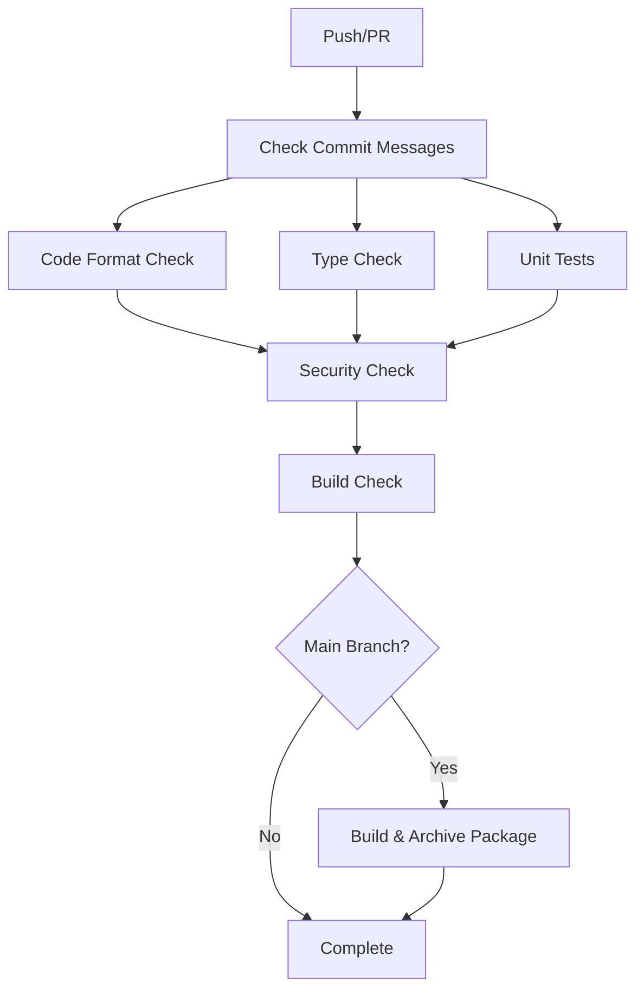

# Python Project CI/CD Template

A comprehensive CI/CD template for Python projects with automated code quality checks, testing, and package building using GitHub Actions.

## Features

- 🔍 **Git commit message format validation**
- 🎨 **Code formatting with Ruff and clang-format**
- 🔧 **Static type checking with MyPy**
- 🧪 **Comprehensive testing with pytest**
- 🔒 **Security scanning with Bandit and Safety**
- 📦 **Automated package building and validation**
- 🚀 **Optional PyPI publishing and GitHub releases**

## Git Commit Message Format

This project enforces a structured commit message format to ensure clear and traceable project history.

### Required Format

```
<type>[<SCOPE>]: <short-summary>

Problem:
<description of the problem being solved>

Solution:
<description of the solution implemented>

Test:
<description of how the change was tested>

JIRA: <PROJECT-123>
```

### Parameters

- **`<type>`**: Type of change
	- `feat`: New feature
	- `fix`: Bug fix
	- `docs`: Documentation changes
	- `style`: Code style changes (formatting, etc.)
	- `refactor`: Code refactoring
	- `test`: Adding or updating tests
	- `chore`: Maintenance tasks
- **`<SCOPE>`**: Area of the codebase affected (e.g., `api`, `auth`, `ui`, `db`)
- **`<short-summary>`**: Brief description in imperative mood
- **`JIRA`**: Reference to JIRA ticket in format `PROJECT-123`

### Example

```
feat[auth]: add JWT-based user authentication

Problem:
The application needs secure user authentication to protect sensitive operations and provide personalized user experiences.

Solution:
Implemented JWT-based authentication system with bcrypt password hashing, including login, logout, and token refresh mechanisms. Added middleware for route protection and user session management.

Test:
Added comprehensive unit tests for authentication functions (95% coverage) and integration tests for login/logout endpoints. Tested token expiration and refresh scenarios.

JIRA: AUTH-456
```

## Project Structure

The recommended project structure follows Python packaging best practices:

```
your-python-project/
├── .github/
│   └── workflows/
│       └── ci.yml                    # Main CI/CD pipeline
├── ci/                              # CI tools directory
│   ├── check_mr_logs.py             # Git commit message checker
│   ├── code_format_helper.py        # Code formatting checker
│   ├── typing_helper.py             # Static type checker
│   └── ruff.toml                    # Ruff configuration
├── src/                             # Source code directory
│   └── your_package/
│       ├── __init__.py
│       └── main.py
├── tests/                           # Test directory
│   ├── __init__.py
│   └── test_main.py
├── .gitignore                       # Git ignore file
├── .gitmessage                      # Git commit template
├── pyproject.toml                   # Project configuration
├── requirements.txt                 # Production dependencies
├── requirements-dev.txt             # Development dependencies
├── README.md                        # This file
├── LICENSE                          # License file
└── CHANGELOG.md                     # Change log
```

### Key Files

#### `pyproject.toml`

Modern Python project configuration file containing:

- Project metadata and dependencies
- Build system configuration
- Tool configurations (pytest, mypy, ruff)

```toml
[project]
name = "your-project-name"
version = "0.1.0"
description = "Your project description"
requires-python = ">=3.9"
dependencies = []

[project.optional-dependencies]
dev = ["pytest>=7.0", "mypy>=1.0", "ruff>=0.1"]
```

#### `ci/ruff.toml`

Code formatting and linting configuration:

- Line length: 88 characters
- Python target version: 3.11
- Enabled rules: pyflakes, pycodestyle, security warnings

## CI/CD Pipeline

The GitHub Actions workflow provides a comprehensive automated pipeline that runs on every push and pull request.

### Pipeline Overview



### Pipeline Stages

#### 1. **Check Commit Messages** (`check-commit-logs`)

- Validates git commit message format
- Ensures all commits follow the required template
- **Trigger**: All pushes and PRs
- **Failure**: Stops entire pipeline

#### 2. **Code Format Check** (`code-format-check`)

- **Python**: Formatting and linting with Ruff
- **C/C++**: Formatting with clang-format
- Checks only changed files for efficiency
- **Configuration**: Uses `ci/ruff.toml`

#### 3. **Type Check** (`type-check`)

- Static type analysis with MyPy
- Checks only changed Python files
- **Configuration**: Defined in `pyproject.toml`

#### 4. **Unit Tests** (`unit-tests`)

- Runs comprehensive test suite with pytest
- **Matrix testing**: Python 3.9, 3.10, 3.11, 3.12
- **Coverage reporting**: Generates coverage reports
- **Integration**: Uploads coverage to Codecov (optional)

#### 5. **Security Check** (`security-check`)

- **Bandit**: Scans Python code for security issues
- **Safety**: Checks dependencies for known vulnerabilities
- **Artifacts**: Saves security reports for review

#### 6. **Build Check** (`build-check`)

- Validates package can be built correctly
- **Dependencies**: All previous checks must pass
- Uses `python -m build` and `twine check`

#### 7. **Build and Archive** (`build-and-archive`)

- **Trigger**: Only on main branch pushes after all checks pass
- **Package Building**: Creates wheel and source distributions
- **Validation**: Verifies package integrity with twine
- **Artifacts**: Saves packages for 30 days
- **Build Info**: Generates detailed build reports
- **Optional Release**: Creates GitHub release if tag is pushed

### Build Artifacts

Each successful build produces:

- **Package files**: `.whl` (wheel) and `.tar.gz` (source distribution)
- **Build summary**: Detailed report with version, commit info, and status
- **30-day retention**: Available for download from GitHub Actions

### Local Development Workflow

```bash
# Setup development environment
pip install -r requirements-dev.txt

# Pre-commit checks
ruff format .          # Format code
ruff check .          # Lint code
mypy src/             # Type check
pytest                # Run tests
bandit -r src/        # Security scan

# Commit with proper format
git commit            # Uses .gitmessage template
```

### Configuration Requirements

#### GitHub Repository Settings

1. **Enable GitHub Actions** in repository settings

2. Branch Protection

	 for main branch (recommended):

	- Require PR reviews
	- Require status checks to pass
	- Require branches to be up to date

#### Optional Secrets (for publishing)

- `PYPI_API_TOKEN`: For PyPI package publishing
- `CODECOV_TOKEN`: For code coverage reporting

### Quick Start

1. **Use this template** or copy the structure

2. Copy CI tools

	 to 

	```
	ci/
	```

	 directory:

	```bash
	cp your-tools/* ci/chmod +x ci/*.py
	```

3. **Copy workflow** to `.github/workflows/ci.yml`

4. Update configuration

	:

	- Modify `pyproject.toml` with your project details
	- Update package name and structure

5. **Install dependencies**: `pip install -r requirements-dev.txt`

6. **Make first commit** using the required format

7. **Push to GitHub** and watch the CI pipeline run

### Upgrading to Full Release Pipeline

To enable automatic PyPI publishing:

1. **Add PyPI token** to GitHub Secrets

2. Push a git tag

	 for version release:

	```bash
	git tag v1.0.0git push origin v1.0.0
	```

3. **Automatic publishing** will be triggered for tagged releases

## Contributing

1. Fork the repository
2. Create a feature branch
3. Follow the commit message format
4. Ensure all CI checks pass
5. Submit a pull request

## License

This project is licensed under the MIT License - see the [LICENSE](https://demo.fuclaude.com/chat/LICENSE) file for details.

## Support

- 📚 **Documentation**: Check the workflow files and configuration
- 🐛 **Issues**: Report bugs via GitHub Issues
- 💡 **Suggestions**: Feature requests welcome

